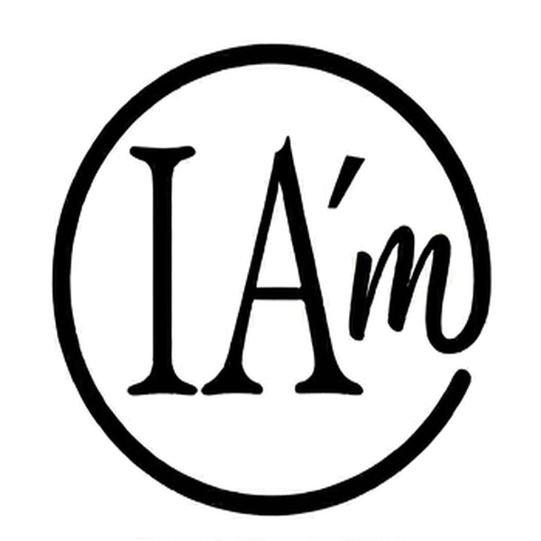

  

  <strong>IA'm</strong> 
  <em>Label éthique de co-création IA-humain</em> 
  <em>Human–AI Co-creation Ethical Label</em>

  <a href="#pourquoi-iam">Pourquoi IA'm</a> ·
  <a href="#utilisation">Utilisation</a> ·
  <a href="#ce-que-le-label-affirme">Principes</a> ·
  <a href="#faq">FAQ</a> ·
  <a href="#licence">Licence</a>

---

## IA'm

IA'm est un label volontaire destiné à identifier toute création réalisée en collaboration entre un humain et une intelligence artificielle.  
Il ne certifie pas une machine — il affirme la présence humaine.

*IA'm is a voluntary label to identify any work created in collaboration between a human and an artificial intelligence.  
It does not certify a machine — it asserts human presence.*

---

## Pourquoi IA'm

IA'm a été conçu pour rendre visible une co-création assumée, transparente et responsable.  
Le label ne remplace ni le droit, ni une certification institutionnelle : il propose un geste simple de déclaration.

*IA'm was designed to make acknowledged, transparent, and responsible co-creation visible.  
The label does not replace law or institutional certification: it offers a simple act of declaration.*

---

## Utilisation

Apposer IA'm est un acte libre et éclairé.  
Personne n'y est contraint — ni par la loi, ni par une institution.

*Using IA'm is a free and informed act.  
No one is required to do so — not by law, not by any institution.*

### Mentions recommandées

**Mention courte**  
> IA'm — Co-créé avec l'IA

**Mention standard**  
> Ce contenu a été co-créé par un humain et une intelligence artificielle. Label IA'm — github.com/myaiinside-png/IAm

**Mention développée**  
> Le présent travail a été réalisé en collaboration avec un système d'intelligence artificielle, sous la supervision et la direction de son auteur humain. Conformément aux principes du label IA'm, cette collaboration est revendiquée explicitement dans un souci de transparence et d'éthique créative.

---

## Ce que le label affirme

IA'm affirme :
- Qu'un humain a initié, dirigé et assumé la création.
- Qu'une IA a participé activement au processus créatif.
- Que cette collaboration est revendiquée avec transparence.

IA'm **n'affirme pas** :
- Que la création est entièrement originale.
- Que l'IA utilisée est certifiée éthique.
- Que la création est libre de droits.

---

## Exemples d’usage

- Articles, essais, publications.
- Portfolios et sites personnels.
- Projets artistiques et associatifs.
- Travaux pédagogiques et universitaires.
- Médias sociaux et contenus de présentation.

---

## FAQ

### IA'm est-il une certification ?
Non. IA'm est un label déclaratif et volontaire, pas une certification technique, juridique ou institutionnelle.

### Puis-je l'utiliser gratuitement ?
Oui, pour un usage personnel, éducatif, artistique ou associatif, conformément à la licence CC BY-NC 4.0.

### Puis-je l'utiliser dans un contexte commercial ?
Pour tout usage commercial ou institutionnel, merci de contacter : **liolb@iam-inside.eu**

---

## Licence

Licence : **CC BY-NC 4.0** — libre pour tout usage personnel, éducatif, artistique et associatif.  
Pour tout usage commercial ou institutionnel : **liolb@iam-inside.eu**

---

## Contact

Lionel Le Berre  
[liolb@iam-inside.eu](mailto:liolb@iam-inside.eu)

---

## Mots-clés

`human-AI collaboration` `co-creation label` `AI transparency` `AI ethics` `AI Act` `artificial intelligence badge` `human creativity` `AI disclosure` `label IA` `co-création intelligence artificielle` `transparence IA` `badge IA` `éthique IA` `création assistée par IA`

---

*IA'm — Affirmer la créativité humaine à l'ère de l'intelligence artificielle.*  
*IA'm — Affirming human creativity in the age of artificial intelligence.*
