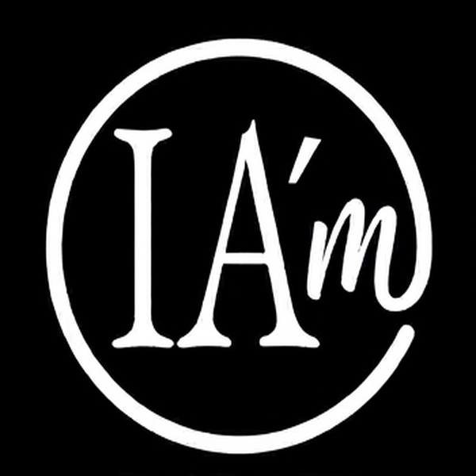

  

  <strong>IA'm</strong> 
  <em>Label éthique de co-création humain–IA</em> 
  <em>Human–AI Co-creation Ethical Label</em>

  <a href="#pourquoi">Pourquoi</a> ·
  <a href="#telecharger">📥 Badge</a> ·
  <a href="#utilisation">Utilisation</a> ·
  <a href="#principes">Principes</a> ·
  <a href="#faq">FAQ</a> ·
  <a href="#licence">Licence</a>

---

## IA'm en une phrase

**IA'm identifie les créations réalisées en collaboration humain–IA, sous direction et responsabilité humaines.**

*IA'm identifies works created in human–AI collaboration, under human direction and responsibility.*

---

## 📥 Télécharger le badge officiel 

<table align="center">
<tr>
  <td align="center" width="25%">
    <a href="badges/IAm-logo-120.png" download>
      
       <strong>120 px</strong> 
      <em>Réseaux sociaux</em>
    </a>
  </td>
  <td align="center" width="25%">
    <a href="badges/IAm-logo-180.png" download>
      
       <strong>180 px</strong> 
      <em>Articles, README</em>
    </a>
  </td>
  <td align="center" width="25%">
    <a href="badges/IAm-logo-300.png" download>
      
       <strong>300 px</strong> 
      <em>Impression</em>
    </a>
  </td>
  <td align="center" width="25%">
    <a href="badges/IAm-logo-dark.png" download>
      
       <strong>Sombre</strong> 
      <em>Fond clair</em>
    </a>
  </td>
</tr>
</table>

  <a href="badges/IAm-logo.svg" download><strong>↓ SVG vectoriel</strong></a>

**Instructions d'usage :**
- Conserver « IA'm » avec apostrophe
- Associer à une mention : *Co-créé avec l'IA*
- Lien recommandé : [myaiinside-png.github.io/IAm](https://myaiinside-png.github.io/IAm)

---

## Pourquoi IA'm ? 

IA'm rend visible une co-création assumée, transparente et responsable.
Le label ne remplace ni le droit, ni une certification : c'est un geste simple de déclaration.

*IA'm makes acknowledged, transparent, and responsible co-creation visible.
The label does not replace law or certification: it's a simple act of declaration.*

---

## Utilisation 

Apposer IA'm est libre et éclairé. Personne n'y est contraint.

*Using IA'm is voluntary and informed. No one is required to do so.*

### Mentions recommandées

**Courte** — réseaux sociaux
> IA'm · Co-créé avec l'IA / Co-created with AI

**Standard** — articles, posts
> Ce contenu a été co-créé par un humain et une IA. Label IA'm — myaiinside-png.github.io/IAm

**Développée** — publications
> Réalisé en collaboration avec une IA, sous supervision humaine. Label IA'm.

---

## Principes 

✅ **IA'm affirme :**
- Humain initiateur, directeur, responsable
- IA participante au processus créatif
- Collaboration revendiquée avec transparence

❌ **IA'm n'affirme pas :**
- Originalité totale de la création
- Éthique certifiée de l'IA utilisée
- Liberté de droits de la création

---

## Exemples d'usage

Articles · Portfolios · Projets artistiques · Travaux universitaires · Posts réseaux sociaux · Projets associatifs

---

## FAQ 

**IA'm est-il une certification ?**
Non — c'est un label déclaratif volontaire.
*No — it's a voluntary declarative label.*

**Usage gratuit ?**
Oui pour usage personnel, éducatif, artistique et associatif (CC BY-NC 4.0).
*Yes for personal, educational, artistic, and non-profit use (CC BY-NC 4.0).*

**Usage commercial ou institutionnel ?**
Contacter [liolb@iam-inside.eu](mailto:liolb@iam-inside.eu)

---

## Licence 

**CC BY-NC 4.0** — Usage personnel, éducatif, artistique, associatif.
Commercial/institutionnel : [liolb@iam-inside.eu](mailto:liolb@iam-inside.eu)

Marque déposée INPI n° 5212301 — classe 41.
*Trademark registered INPI n° 5212301 — class 41.*

---

## Contact

**Lionel Le Berre**
[liolb@iam-inside.eu](mailto:liolb@iam-inside.eu) · Plogoff, Bretagne

---

`IA'm` `label IA` `co-création IA` `transparence IA` `human-AI` `AI transparency` `AI ethics` `AI disclosure`

---

<em>IA'm — Affirmer la créativité humaine à l'ère de l'IA.</em>

