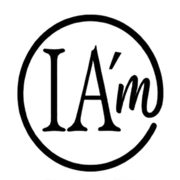

  

  <strong>IA'm</strong> 
  <em>Label éthique de co-création IA-humain</em> 
  <em>Human–AI Co-creation Ethical Label</em>

  <a href="#pourquoi-iam">Pourquoi</a> ·
  <a href="#telecharger">📥 Badge</a> ·
  <a href="#utilisation">Utilisation</a> ·
  <a href="#principes">Principes</a> ·
  <a href="#faq">FAQ</a> ·
  <a href="#licence">Licence</a>

---

## IA'm en 1 phrase

**IA'm identifie les créations réalisées en collaboration humain–IA, sous direction et responsabilité humaines.**

*IA'm identifies works created in human–AI collaboration, under human direction and responsibility.*

---

## 📥 Télécharger le badge officiel IA'm

  <strong>Toutes les tailles disponibles</strong>

<table align="center">
<tr>
  <td align="center" width="33%">
    <a href="badges/IAm-logo-120.png" download>
      
       <strong>120px</strong> 
      <em>Réseaux sociaux</em>
    </a>
  </td>
  <td align="center" width="33%">
    <a href="badges/IAm-logo-180.png" download>
      
       <strong>180px</strong> 
      <em>Articles, README</em>
    </a>
  </td>
  <td align="center" width="33%">
    <a href="badges/IAm-logo-300.png" download>
      
       <strong>300px</strong> 
      <em>Impression</em>
    </a>
  </td>
</tr>
<tr>
  <td colspan="3" align="center" style="padding-top: 20px;">
    <a href="badges/IAm-logo.svg" download><strong>SVG (vectoriel)</strong></a> 
    · 
    <a href="badges/IAm-logo-dark.png" download><strong>Version foncée</strong></a>
  </td>
</tr>
</table>

**Instructions d'usage :**
- Conserver "IA'm" avec apostrophe
- Associer à une mention : "Co-créé avec l'IA"
- Lien optionnel : github.com/myaiinside-png/IAm

---

## Pourquoi IA'm ?

IA'm rend visible une co-création assumée, transparente et responsable.  
Le label ne remplace ni le droit, ni une certification : c'est un geste simple de déclaration.

*IA'm makes acknowledged, transparent, and responsible co-creation visible.  
The label does not replace law or certification: it's a simple act of declaration.*

---

## Utilisation

Apposer IA'm est libre et éclairé. Personne n'y est contraint.

### Mentions recommandées

**Courte** (réseaux sociaux)  
> IA'm — Co-créé avec l'IA  
> IA'm — Co-created with AI

**Standard** (articles, posts)  
> Ce contenu a été co-créé par un humain et une IA. Label IA'm — github.com/myaiinside-png/IAm

**Développée** (publications)  
> Réalisé en collaboration avec une IA, sous supervision humaine. Label IA'm.

---

## Principes

✅ **IA'm affirme :**
- Humain initiateur, directeur, responsable
- IA participante au processus créatif  
- Collaboration revendiquée avec transparence

❌ **IA'm n'affirme pas :**
- Originalité totale de la création
- Éthique certifiée de l'IA utilisée
- Liberté de droits de la création

---

## Exemples d'usage

- Articles, essais, publications
- Portfolios, sites personnels  
- Projets artistiques, associatifs
- Travaux étudiants, universitaires
- Posts réseaux sociaux

---

## FAQ

**Q: IA'm est-il une certification ?**  
A: Non, c'est un label déclaratif volontaire.

**Q: Usage gratuit ?**  
A: Oui pour personnel, éducatif, artistique, associatif (CC BY-NC 4.0).

**Q: Usage commercial ?**  
A: Contacter liolb@iam-inside.eu

---

## Licence

**CC BY-NC 4.0** — Usage personnel, éducatif, artistique, associatif.  
**Commercial/institutionnel :** liolb@iam-inside.eu

---

## Contact

**Lionel Le Berre**  
[liolb@iam-inside.eu](mailto:liolb@iam-inside.eu)

---

## Mots-clés SEO

`IA'm` `label IA` `co-création IA` `human-AI` `AI transparency` `AI ethics` `AI disclosure`

---

  *IA'm — Affirmer la créativité humaine à l'ère de l'IA.*

