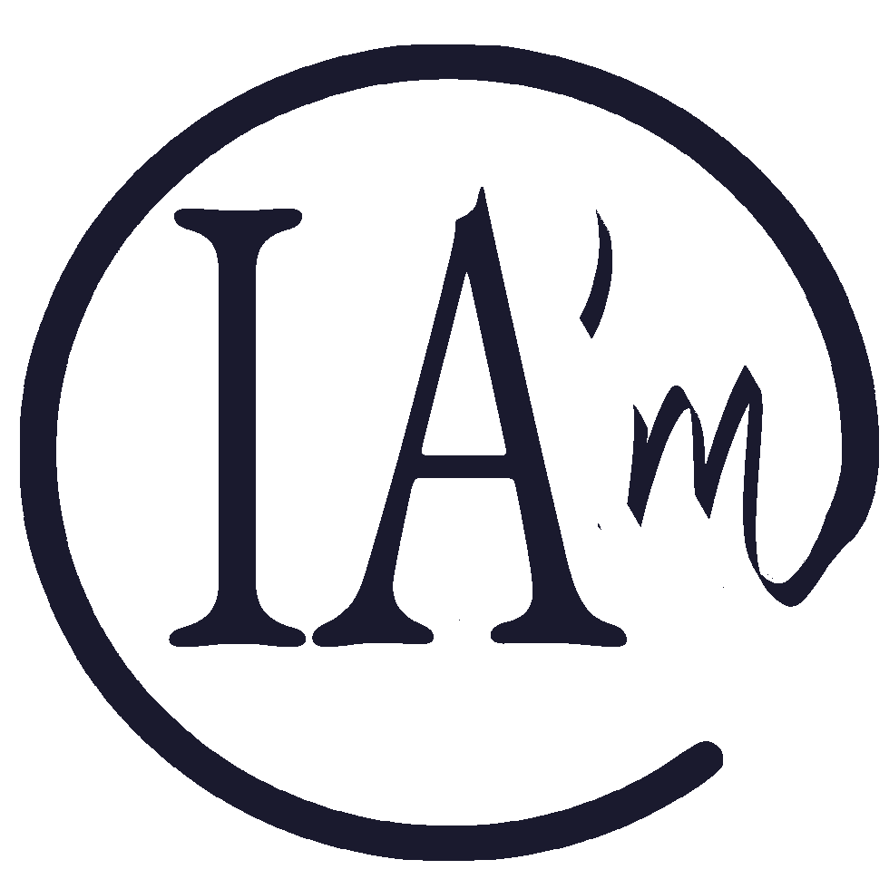

# IA'm

  

**Label éthique de co-création IA-humain**
**Human–AI Co-creation Ethical Label**

---

IA'm est un label volontaire destiné à identifier toute création réalisée en collaboration entre un humain et une intelligence artificielle. Il ne certifie pas une machine — il affirme la présence humaine.

*IA'm is a voluntary label to identify any work created in collaboration between a human and an artificial intelligence. It does not certify a machine — it asserts human presence.*

---

## Utilisation / How to use

Apposer IA'm est un acte libre et éclairant. Personne n'y est contraint — ni par la loi, ni par une institution. C'est précisément ce choix qui lui donne sa valeur.

*Using IA'm is a free and informed act. No one is required to do so — not by law, not by any institution. That is precisely what gives it its value.*

Usage libre pour tout créateur dans les domaines culturels, artistiques et éducatifs.
*Free for any creator in cultural, artistic and educational fields.*

---

## Ce dépôt contient / This repository contains

- Logo (PNG, SVG)
- Kit de marque / Brand kit
- Modèles de licence / Licence templates
- Charte & valeurs / Charter & values
- Manifeste / Manifesto

---

## Contact

L LB — [my.ai.inside@gmail.com](mailto:my.ai.inside@gmail.com)
Marque INPI n° 5212301 · Classe 41

---

## Keywords / Mots-clés SEO

`human-AI collaboration` `co-creation label` `AI transparency` `AI ethics` `AI Act` `artificial intelligence badge` `human creativity` `AI disclosure` `label IA` `co-création intelligence artificielle` `transparence IA` `badge IA` `éthique IA` `création assistée par IA` `label éducation IA` `AI watermark` `human-centered AI`

---

*IA'm — Affirmer la créativité humaine à l'ère de l'intelligence artificielle.*
*IA'm — Affirming human creativity in the age of artificial intelligence.*
